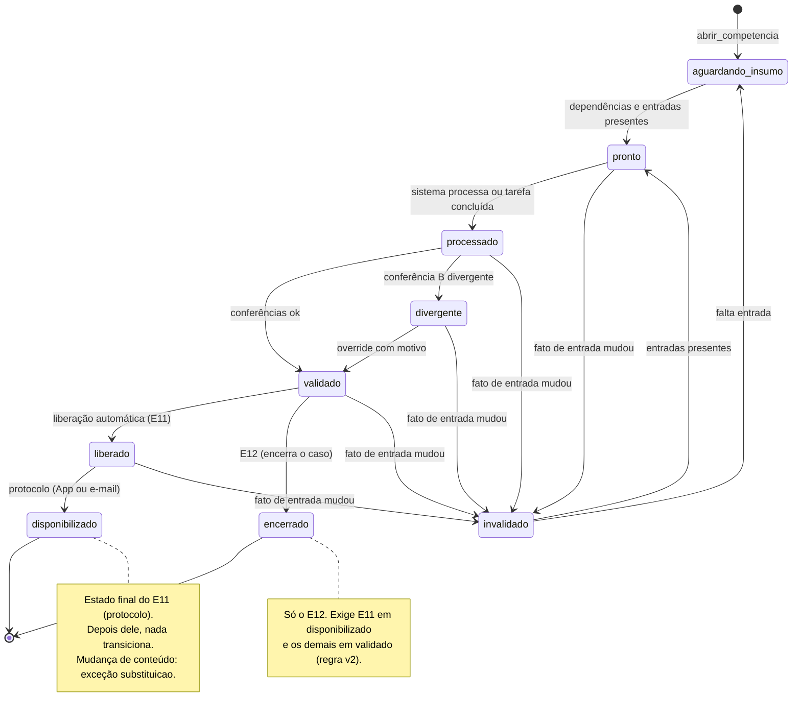
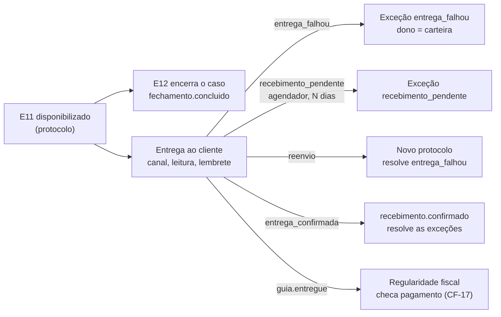
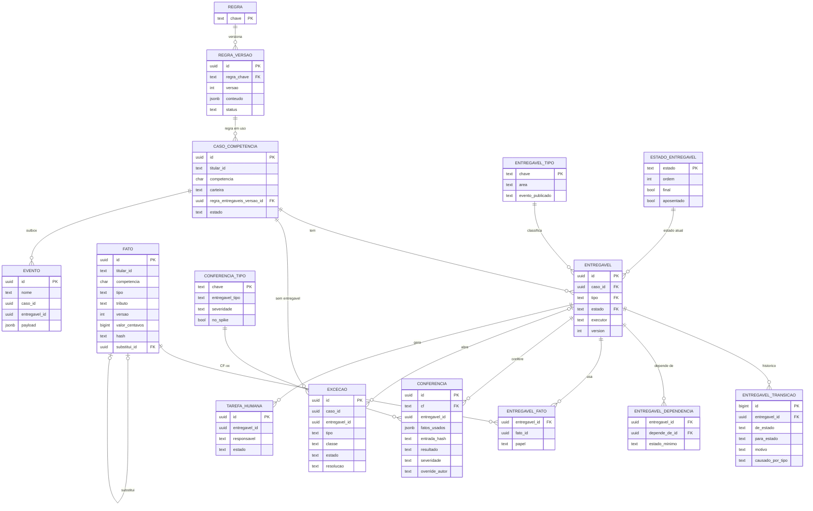

# Diagramas do motor do fechamento (semântica v3)

**07/10/2026.** Desenhos de consulta. A fonte normativa continua sendo `docs/semantica-do-motor.md` e as migrações em `db/migrations/`. Se divergirem, vale o texto e o SQL.

## 1 · Estados do entregável e o que vem depois do protocolo

**Depois do protocolo (§10.3 e §15), sem reabrir o caso e sem transição:**

- Estado `pago` aposentado (V006). Pagamento é da Regularidade fiscal.
- Caso encerrado não volta: fato novo vira a exceção `competencia_encerrada` (§11.3).

## 2 · Tabelas (colunas principais)

Ligações marcadas como FK existem no banco. As de `conferencia`, `excecao`, `tarefa_humana`, `evento` e `entregavel_fato.fato_id` são **lógicas** (só o id), porque cada módulo tem o seu esquema (ADR-014). `entregavel_transicao` e `fatos.fato` são só de inserção.

Fora do desenho: `regra_caso_ouro`, `calendario`, `transicao_permitida`, `eventos.fila`, `eventos.entrega_evento` e as views `indicadores.i1`–`i6`.

